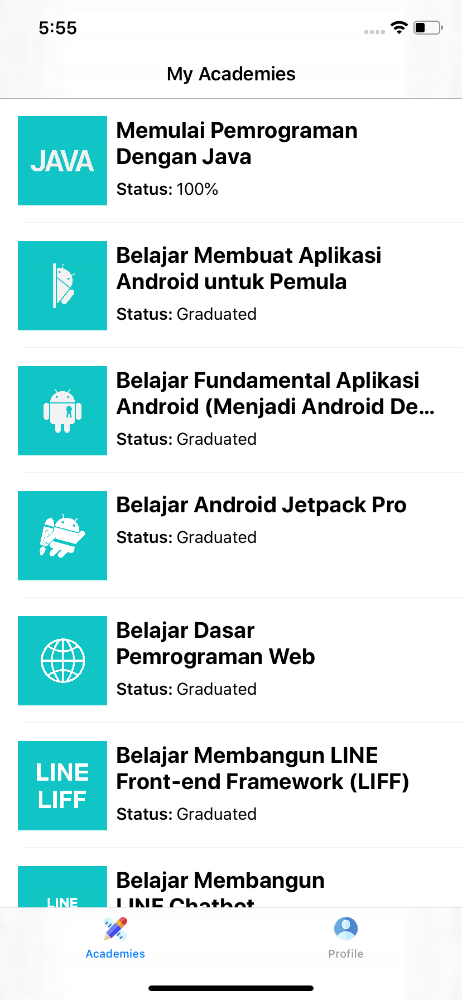
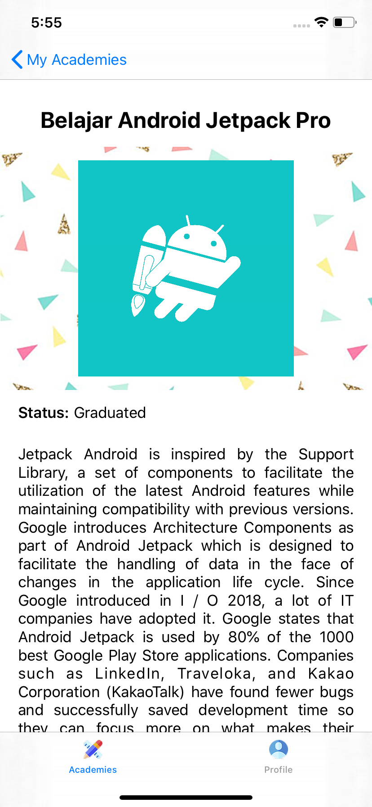
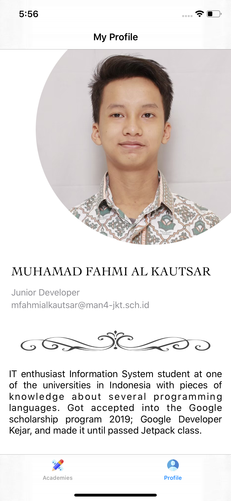

# My Dicoding Profile
My Dicoding Profile is kind of my CV app, but just in Dicoding scope; showing my little profile and accomplishment at Dicoding Class (it's actually an unnecessary thing. I ran out of idea about what app should I make to pass this class).

This Repository is my class assignment at Dicoding Indonesia online course platform at class: Belajar Membuat Aplikasi iOS untuk Pemula (Learn making iOS Application for Beginner) https://www.dicoding.com/academies/171. I've enrolled in this class as a part of IDCamp Indosat Ooredoo 2020.

## Screenshots
&nbsp;

## Author
* **Fahmi Al**